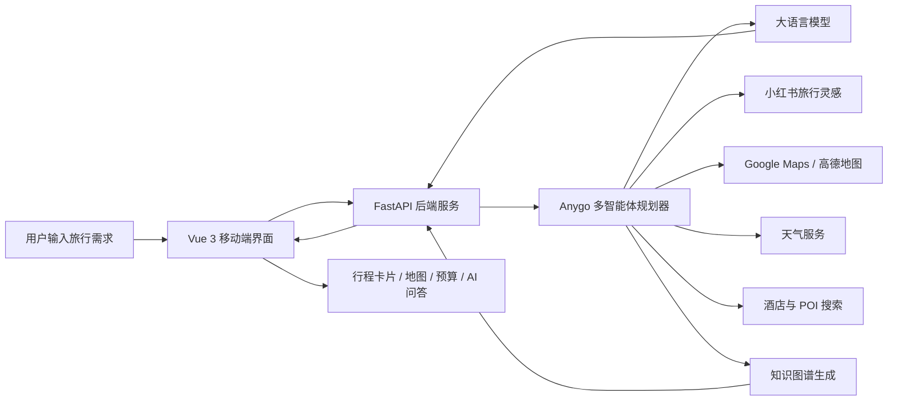

<div align="center">
  
</div>

<p align="center">
  
  
  
  
  
  
</p>

<div align="center">

[中文](README.md) | [English](README_en.md) | [日本語](README_ja.md)

# Anygo

### AI 旅行规划智能体 · 移动端优先的多智能体旅行助手

</div>

> [!IMPORTANT]
> Anygo 支持本地部署，可直接体验项目界面与基础流程。若要完整体验旅行计划生成、景点地图概览、预算明细、每日行程、住宿推荐、天气信息、小红书灵感、知识图谱可视化与沉浸式伴游 AI 问答等功能，需要提前配置相关 API Key 与 Cookie。

## 项目简介

**Anygo** 是一款 AI 旅行规划应用，面向想要快速获得可执行旅行攻略的用户。它可以根据目的地、日期、交通方式、住宿偏好和旅行兴趣，生成一份结构清晰、适合手机端浏览的个性化多城市行程。

我希望 Anygo 不只是一个普通的旅游攻略页面，而是更像一位随身旅行管家：它能帮用户减少查资料、比攻略、做选择的时间，把分散的信息整理成可执行的旅行计划。项目结合 **大语言模型 LLM**、**多智能体 Multi-Agent 协作**、地图服务、小红书旅行灵感、天气查询和知识图谱展示，让旅行规划从“到处搜索”变成“输入需求后直接获得方案”。

## Anygo 能做什么

- **生成旅行计划**：根据出发地、目的地、旅行天数、预算、偏好和节奏，生成完整行程。
- **每日行程卡片**：展示行程描述、交通方式、景点安排、游览时长、餐饮建议和住宿推荐。
- **景点地图概览**：结合经纬度信息展示景点位置，帮助用户快速理解路线分布。
- **预算明细汇总**：拆分交通、住宿、餐饮、门票等费用，让旅行成本更直观。
- **预约与提醒**：识别需要提前预约或注意开放时间的景点，减少踩坑。
- **天气信息辅助**：结合天气数据，让行程安排更贴近真实出行场景。
- **小红书旅行灵感**：从真实游记中提取热门景点、避坑建议、拍照点和本地体验。
- **知识图谱可视化**：把城市、日期、景点、预算和建议转化为可视化关系网络。
- **沉浸式伴游 AI 问答**：生成行程后，用户可以继续追问细节，例如“这天会不会太赶”“预算怎么省”“哪里适合拍照”。

## 核心亮点

### 移动端优先体验

Anygo 当前版本重新调整了前端结构和 UI，界面更适合手机端浏览。行程表单、结果页、预算、地图与每日安排都以移动端阅读体验为中心设计，方便用户在真实出行场景中随时查看。

### 多智能体协作

项目基于 HelloAgents 思路组织旅行规划流程，将景点搜索、天气查询、酒店推荐、路线安排和最终行程整合拆分为不同能力模块。相比单次问答式生成，多智能体协作更适合处理复杂旅行规划任务。

### 真实旅行信息融合

Anygo 不只依赖模型凭空生成内容。它会结合小红书游记、地图 POI、天气信息和酒店搜索结果，再交给 LLM 进行整理、筛选和结构化输出，让结果更接近真实旅行需求。

### Apple 风格玻璃质感 UI

前端采用浅色、通透、玻璃拟态的视觉风格，尽量贴近 iOS 应用的轻盈感。重点不是做一个复杂后台，而是做一个用户愿意在手机上打开、浏览和保存的旅行助手。

## 功能模块

| 模块 | 说明 |
| --- | --- |
| 旅行计划生成 | 根据用户输入生成完整旅行方案 |
| 景点推荐 | 整合小红书内容与地图 POI 信息 |
| 每日行程 | 输出每日景点、餐饮、住宿与交通安排 |
| 预算面板 | 汇总住宿、交通、餐饮、门票等费用 |
| 地图概览 | 展示景点坐标、路线与空间分布 |
| 天气查询 | 辅助判断每日出行安排 |
| 知识图谱 | 可视化展示旅行计划结构 |
| AI 问答 | 基于已生成行程继续追问 |
| 多语言支持 | 支持中文、英文、日文界面与内容 |

## 系统架构

Anygo 采用前后端分离架构：前端负责移动端交互与结果展示，后端负责智能体调度、地图服务、小红书数据处理、LLM 调用和任务状态管理。



## 技术栈

- **前端**：Vue 3, TypeScript, Vite, Vue Router, Vue I18n
- **后端**：FastAPI, Python 3.10+, Pydantic, Uvicorn
- **智能体**：HelloAgents 风格多智能体工作流
- **模型调用**：兼容 OpenAI 格式的大模型服务
- **地图服务**：高德地图、Google Maps
- **数据来源**：小红书旅行内容、地图 POI、天气接口
- **可视化**：地图路线展示、知识图谱数据结构

## 本地运行

### 环境准备

- Python 3.10+
- Node.js 18+
- 大模型 API Key
- 高德地图 Web 服务 Key 与 Web JS API Key
- 可选：Google Maps API Key
- 可选：小红书 Cookie，用于获取更丰富的旅行灵感

### 后端启动

```bash
cd backend
npm install
python3 -m venv .venv
source .venv/bin/activate
pip install -r requirements.txt
cp .env.example .env
uvicorn app.api.main:app --host 0.0.0.0 --port 8000 --reload
```

启动后可访问：

```text
http://localhost:8000/docs
```

### 前端启动

```bash
cd frontend
npm install
cp .env.example .env
npm run dev
```

启动后访问终端显示的本地地址，通常是：

```text
http://localhost:5173
```

## 环境变量说明

后端 `.env` 主要配置：

```env
OPENAI_API_KEY=你的大模型 API Key
OPENAI_BASE_URL=https://api.openai.com/v1
OPENAI_MODEL=gpt-4
VITE_AMAP_WEB_KEY=你的高德 Web 服务 Key
GOOGLE_MAPS_API_KEY=可选
GOOGLE_MAPS_PROXY=可选
XHS_COOKIE=可选
```

前端 `.env` 主要配置：

```env
VITE_API_BASE_URL=http://localhost:8000
VITE_AMAP_WEB_KEY=你的高德 Web 服务 Key
VITE_AMAP_WEB_JS_KEY=你的高德 Web JS API Key
```

> 注意：没有配置大模型 API Key 时，可以打开前端界面，但无法完整生成 AI 行程。

## Docker 运行

项目也支持通过 Docker / Docker Compose 运行。使用前请先准备好环境变量，并根据自己的 Key 修改 `docker-compose.yaml` 或运行环境配置。

```bash
docker compose up --build
```

## 项目结构

```text
Anygo/
├── backend/                 # FastAPI 后端与智能体逻辑
│   ├── app/agents/           # Anygo 旅行规划智能体
│   ├── app/api/              # API 路由与任务接口
│   ├── app/services/         # 地图、小红书、LLM、知识图谱等服务
│   └── requirements.txt
├── frontend/                # Vue 3 前端应用
│   ├── src/views/            # 页面视图
│   ├── src/components/       # UI 组件
│   ├── src/services/         # 前端 API 请求
│   └── src/styles/           # 全局样式
├── docs/                    # 项目结构说明
├── docker-compose.yaml
└── README.md
```

## 适合的使用场景

- 想快速规划一场城市旅行
- 想把小红书攻略整理成可执行行程
- 想在手机上清楚查看每天怎么玩
- 想同时参考预算、天气、地图和住宿建议
- 想继续和 AI 讨论行程细节

## 项目定位

Anygo 是一个 AI 旅行规划智能体项目，也是我对“智能体如何进入真实生活场景”的一次实践。它尝试把旅行规划中最耗时的信息搜索、路线整理、预算估算和细节问答交给 AI，让用户把更多精力留给真正的出发。
